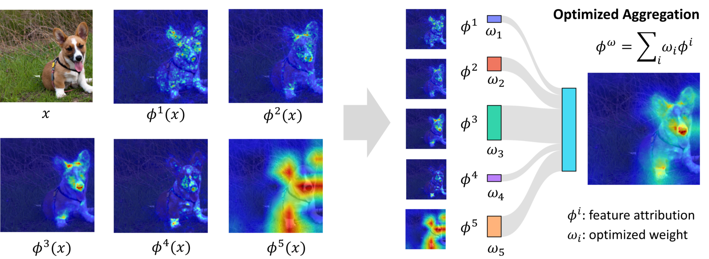

# Provably Better Explanations with Optimized Aggregation of Feature Attributions (ICML 2024)

This repository contains code related to the paper ["Provable Better Explanations with Optimized Aggregation of Feature Attributions"](https://arxiv.org/abs/2406.05090), published at ICML 2024. 
The code utilizes [Captum](https://captum.ai/) and the feature attribution methods provided by it. 



Different feature attribution methods provide distinct perspectives about which particular features of an input are important for a model prediction. But oftentimes they tend to disagree causing ambiguity about which inputs truly matter. Our method derives optimal combinations of feature attributions with provable improvements in explanation quality including robustness or faithfulness to the model behavior.

In case you find this work useful please cite:
```
@inproceedings{decker2024provably,
  title={Provably Better Explanations with Optimized Aggregation of Feature Attributions},
  author={Decker, Thomas and Bhattarai, Ananta R and Gu, Jindong and Tresp, Volker and Buettner, Florian},
  booktitle={Proceedings of the 41th International Conference on Machine Learning},
  year={2024},
}
```